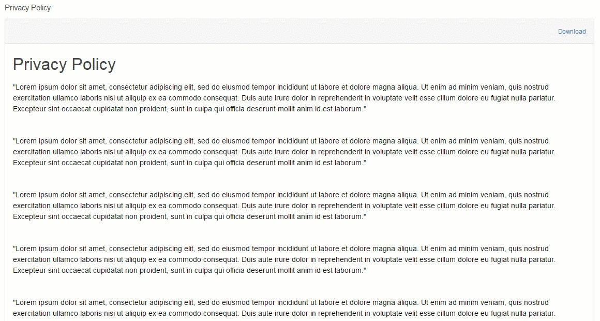
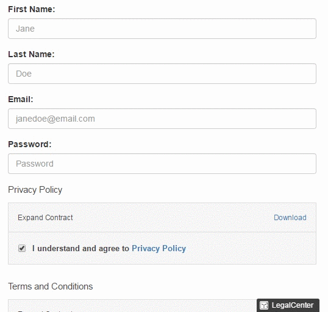

# PactSafe Angular SDK

Angular SDK for easy Clickwrap/Browsewrap implementation leveraging PactSafe's JavaScript Library

## Features

- Automatically loads the PactSafe Snippet into your app so all you have to do is call `_ps` to use the PactSafe Library

#### PSClickWrap Component

- Renders a PactSafe ClickWrap group by providing a site `accessId` and a `groupKey`
- Have more control on what contracts you show by using a `filter` to specify contract ID's and/or tags
- Render a completely dynamic ClickWrap by passing in costom `render_data`
- Override default properties set within PactSafe's App configuration:
  - ClickWrap Style using `clickWrapStyle` (only when using `filter` as well)
  - Signer ID selector using `signerIdSelector`
  - and more! (See more detailed documentation on available PSClickWrap configurations below)

#### PSBrowseWrap Component

- Renders a PactSafe BrowseWrap grou by providing a site `accessId` and `groupKey`
- Override default properties set within PactSafe's App configuration:
  - Position with `position`
  - Visability with `alwaysVisible`
  - and more! (See more detailed documentation on available PSBrowseWrap configurations below)

## Demo & Example

#### PSClickWrap Component



#### PSBrowseWrap Component



#### Example

Included in the project is an example folder. To run the example, navigate to the root of the example folder, then:

```
npm install http-server -g
http-server
```

Open a browser and go to localhost:8081 and the example app should be running and you can see the components in action.

If the app is having permission issues when trying to run, try running the server as an https server as follows:

```
// Create self-signed SSL
openssl req -newkey rsa:2048 -new -nodes -x509 -days 3650 -keyout key.pem -out cert.pem
// Run SSL Server
http-server -S -C cert.pem -o
```

## Installation

The easiest way to use pactsafe-angular-sdk is to install it using NPM and include it in your own Angular 2+ build process.
The module provides you with the transpiled code and an example project using the sdk.

```bash
npm install pactsafe-angular-sdk --save
```

Alternatively, for more flexability, you can clone the repository, allowing you to modify the source code easier, and then use gulp (already preconfigured) to build your src.

- Clone
- Modify src how you want
- `gulp build`
- Use dist in your project as you would with the npm module

## Usage

#### Using PSClickWrap

In order to use the PSClickWrap component, you must import PSModule from `pactsafe-angular-sdk` into your main module

PSClickWrap Component:

``` typescript
// app.module.ts

import { PSModule } from 'pactsafe-angular-sdk'
// ...
@NgModule({
  // ...
  imports: [
    PSModule.forRoot(),
    // Other imports
  ],
  // ...
})
```

With the PSModule properly imported, you should be able to use the PSClickWrap component throughout your project.
The ClickWrap requires you to specify an `accessId`, one of ( `groupKey` or `filter` ), and one of (`signerIdSelector`, `signerId`). The `signerIdSelector` corresponds to an input element whose input will identify the signer (usually an email field), so when the user accepts your terms, the info can be successfully sent to PactSafe. The `signerId` just takes a string and assigns that string as the user's id instead of using the input field, allowing you to programmatically assign this information if need be.

``` html
<!-- sample.component.html -->

<input type="email" id="userEmail" placeholder="Your Email"/>

<ps-click-wrap accessId={YOUR_PACTSAFE_ACCESS_ID_HERE} groupKey={YOUR_GROUP_KEY_HERE} signerIdSelector="userEmail"></ps-click-wrap>

<!-- Using signerId instead -->

<ps-click-wrap accessId={YOUR_PACTSAFE_ACCESS_ID_HERE} groupKey={YOUR_GROUP_KEY_HERE} signerId="JaneDoe"></ps-click-wrap>

```

Replace `YOUR_PACTSAFE_ACCESS_ID_HERE` with your PactSafe Site Access ID found here

Replace `YOUR_GROUP_KEY_HERE` with your group's key found within your PacSafe group's configuration

Pass in any additional options using inputs on the `ps-click-wrap` component as shown above with `accessId`, `groupKey`, and `signerIdSelector`

#### Using PSBrowseWrap

In order to use the PSBrowseWrap component, you must import PSModule from `pactsafe-angular-sdk` into your main module exactly as shown above for the PSClickWrap

With the PSModule properly imported, you should be able to use the PSBrowseWrap component throughout your project.
The BrowseWrap requires you to specify an `accessId`, `groupKey`, and a `linkText`.

``` html
<!-- sample.component.html -->

<ps-browse-wrap accessId={YOUR_PACTSAFE_ACCESS_ID_HERE} groupKey={YOUR_GROUP_KEY_HERE} linkText={YOUR_LINK_TEXT_HERE}></ps-browse-wrap>
```

Replace `YOUR_PACTSAFE_ACCESS_ID_HERE` with your PactSafe Site Access ID found here

Replace `YOUR_GROUP_KEY_HERE` with your group's key found within your PacSafe group's configuration

Replace `YOUR_LINK_TEXT_HERE` with the text you want displyed for your link generated by the BrowseWrap

Pass in any additional options using inputs on the `ps-browse-wrap` component as shown above with `accessId`, `groupKey`, and `linkText`

#### Inputs/Configurations for ClickWrap and BrowseWrap Components

##### PSClickWrap Inputs

|          Input        |                                Type                                       |                 Default                |                 Required?                |                                                                                                                                                        Description                                                                                                                                                       |
|:--------------------:|:----------------------------------------------------------------------------:|:--------------------------------------:|:----------------------------------------:|:------------------------------------------------------------------------------------------------------------------------------------------------------------------------------------------------------------------------------------------------------------------------------------------------------------------------:|
| `accessId`           | string                                                                       | null                                   | Yes                                      | PactSafe site access ID                                                                                                                                                                                                                                                                                                  |
| `clickWrapStyle`     | string.oneOf[`'full'`, `'scroll'`, `'checkbox'`, `'combined'`, `'embedded'`] | Value specified in PactSafe Group's UI | No                                       | Override the clickwrap style specified in the PactSafe Group Interface (only works if using `filter` instead of `groupKey`)                                                                                                                                                                                                                                           |
| `confirmationEmail`  | bool                                                                   | Value specified in PactSafe Group's UI | No                                       | Override whether to send a confirmation email to the signer upon contract acceptance                                                                                                                                                                                                                                     |
| `containerName`      | string                                                                 | ps-clickwrap                           | No, but encouraged if using more than one contract in a group                       | The div ID that will contain your clickwrap. You should override this if you plan on displaying more than one contract on a page.                                                                                                                                                                                        |
| `disableSending`     | bool                                                                   | false                                  | No                                       | Turn this on if you want to manually send the agreed event instead of it automatically being sent on contract acceptance. [See documentation on manually sending the agreed event here.](https://pactsafe.gelato.io/guides/get-to-know-our-javascript-library#3-sending-agreed-in-javascript)                            |
| `displayAll`         | bool                                                                   | true                                   | No                                       | Display all contracts in the group immediately. If disabled, a contract will only be displayed if the signer hasn't accepted the latest version.                                                                                                                                                                         |
| `displayImmediately` | bool                                                                   | true                                   | No                                       | Display the group's contracts as soon as the Signer ID is available. If disabled, contracts will remain hidden until you call `displayRequired()`                                                                                                                                                                        |
| `dynamic`            | bool                                                                   | false                                  | No                                       | If you would like to use dynamic render_data in your contract, you must set this to true. If this is set to true, you MUST also pass an object into the `render_data` prop.                                                                                                                                              |
| `filter`             | string                                                                 | null                                   | If `groupKey` prop is not passed | Allows you to dynamically load contracts without having to specify a group. Filter must be in the format: `id==123,456` OR `id==12345 and tags==tag1,tag2` OR `tags==tag1,tag2`. [See documentation for more information on using dynamic groups.](https://pactsafe.gelato.io/guides/dynamic-groups-and-how-to-use-them) |
| `forceScroll`        | bool                                                                   | Value specified in PactSafe Group's UI | No                                       | Disable acceptance until the signer scrolls to the bottom of each contract.                                                                                                                                                                                                                                              |
| `groupKey`           | string                                                                 | null                                   | If `filter` prop is not passed      | PactSafe group key, this is found within the PactSafe Groups configuration.                                                                                                                                                                                         |
| `renderData`         | object                                                                 | null                                   | If `dynamic` is set to true              | Object containing the dynamic render data for your contract. [For more information on using dynamic contracts, check out this documentation.](https://pactsafe.gelato.io/guides/how-to-use-smart-contracts-with-the-javascript-library#making-your-contract-dynamic)                                                     |
| `signerId`           | string                                                                 | null                                   | If `signerIdSelector` prop is not passed | The ID that will be used to identify the signer (this option lets you programmatically assign the Id instead of using an input field with `signerIdSelector`.                                                                                                                                                                                                                                                |
| `signerIdSelector`   | string                                                                 | null                                   | If `signerId` prop is not passed         | The ID of the `<input>` element that will be used to identify the signer.                                                                                                                                                                                                                                                |
| `testMode`           | bool                                                                   | false                                  | No                                       | Enable this to register any contract acceptances as test data that can be cleared within the PactSafe UI                                                        |

##### PSBrowseWrap Inputs

|        Input            |                                Type                                |                 Default                 |                 Required?                |                                                                                                                                                        Description                                                                                                                                                       |
|:----------------------:|:------------------------------------------------------------------:|:---------------------------------------:|:----------------------------------------:|:------------------------------------------------------------------------------------------------------------------------------------------------------------------------------------------------------------------------------------------------------------------------------------------------------------------------:|
| `accessId`             | string                                                             | null                                    | Yes                                      | PactSafe site access ID                                                                                                                                                                                                                                                                                                  |
| `alwaysVisible`        | bool                                                               | false                                   | No                                       | Keep the badge visible on the page at all times. If disabled, the badge will be hidden if the target link is visible on screen.                                                                                                                                                                                          |
| `badgeText`            | string                                 | value of `linkText`         | No               | Provide alternate text for the BrowseWrap badge                                                                    |
| `groupKey`             | string                                                             | null                                    | Yes               | PactSafe group key, this is found within the PactSafe Groups configuration.                                                                                                                                                                                                                                              |
| `link`         | string                 | null            | If `openLegalCenter` is set to false    | Location of where the BrowseWrap link should redirect to, should only be used if `openLegalCenter` is set to false, otherwise the link will open the group's PactSafe legal center                                    |
| `linkText`    | string                 | null            | Yes            | The text that your BrowseWrap link will display (for example, 'Legal Center' or 'Terms of Service')                                                       |
| `openLegalCenter`      | bool                  | true            | No            | Open this group's legal center page when the badge or link is clicked. If enabled, the target link's original `href` will be replaced.                                               |
| `position`    | string.oneOf[`'middle'`, `'left'`, `'right'`, `'auto'`]        | auto         | No               | Position of where the BrowseWrap badge will float within the browser window                                                             |

## Notes

- **You must run your web app over HTTPS** in order to interact with the PactSafe Activity API (that powers both the PSClickWrap and PSBrowseWrap components)!

- If you are developing in an AngularCli generated project, you may run into trouble using the library. Make sure you set up a path mapping in /src/tsconfig.app.json of your consuming application (not the library) and that should solve any compilation problems you may have:

```js
{
  "compilerOptions": {
    // ...
    // Note: these paths are relative to 'baseUrl' path.
    "paths": {
      "@angular/*": [
        "../node_modules/@angular/*"
      ]
    }
  }
}
```

- Both the components load in the ps library giving you access to the `_ps` global. With that, you can add more advance functionality (checking whether all contracts have been accepted, sending data only on form submit, etc.)
  - `_ps` is defined as a global in the window, so you can access it from any of your angular components
  - If you are having trouble with the linter using `_ps`, include `declare var _ps: any;` at the top of the file you are trying to use it in. This just tells the linter that `_ps` exists.

## License

[MIT License](LICENSE)

Copyright (c) 2017 PactSafe.
